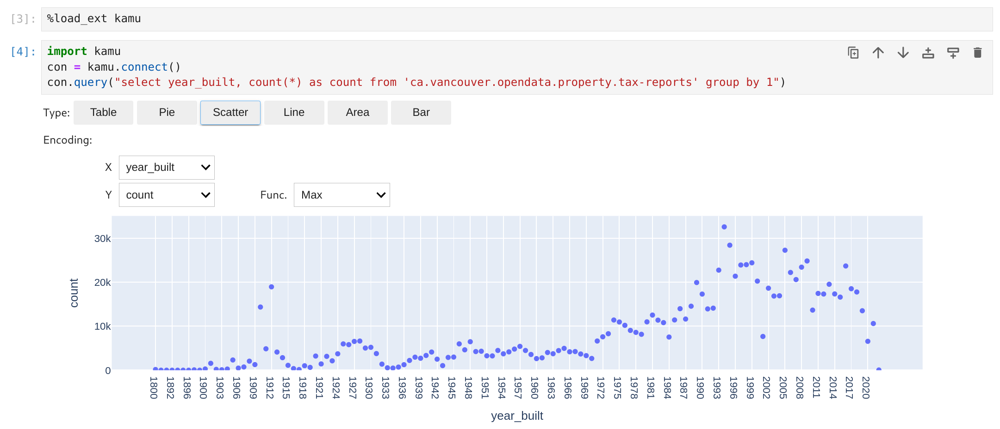

# Kamu client library for Python

## Installing
Install the library:
```bash
pip install kamu
```

Consider installing with extra features:
```bash
pip install kamu[jupyter-autoviz,jupyter-sql,spark]
```

### Extras
- `jupyter-autoviz`- Jupyter auto-viz for Pandas data frames
- `jupyter-sql` - Jupyter `%%sql` cell magic
- `spark` - extra libraries temporarily required to communicate with Spark engine


## Using in plain Python scripts
```python
import kamu

con = kamu.connect("grpc+tls://node.demo.kamu.dev:50050")

# Executes query on the node and returns result as Pandas DataFrame
df = con.query(
    """
    select
        event_time, open, close, volume
    from 'kamu/co.alphavantage.tickers.daily.spy'
    where from_symbol = 'spy' and to_symbol = 'usd'
    order by event_time
    """
)

print(df)
```

The client library is based on modern [ADBC](https://arrow.apache.org/docs/format/ADBC.html) standard and the underlying connection can be used directly with other libraries supporting ADBC data sources:

```python
import kamu
import pandas

con = kamu.connect("grpc+tls://node.demo.kamu.dev:50050")

df = pandas.read_sql_query(
    "select 1 as x",
    con.as_adbc(),
)
```


## Using in Jupyter
Load the extension in your notebook:

```python
%load_ext kamu
```

Create connection:

```python
con = kamu.connect("grpc+tls://node.demo.kamu.dev:50050")
```

Extension provides a convenience `%%sql` magic:

```sql
%%sql
select
    event_time, open, close, volume
from 'kamu/co.alphavantage.tickers.daily.spy'
where from_symbol = 'spy' and to_symbol = 'usd'
order by event_time
```

The above is equivalent to:

```python
con.query("...")
```

To save the query result into a variable use:
```sql
%%sql -o df
select * from x
```

The above is equivalent to:

```python
df = con.query("...")
df
```

To silence the output add `-q`:
```sql
%%sql -o df -q
select * from x
```

The `kamu` extension automatically registers [`autovizwidget`](https://github.com/jupyter-incubator/sparkmagic) to offer some options to visualize your data frames.


